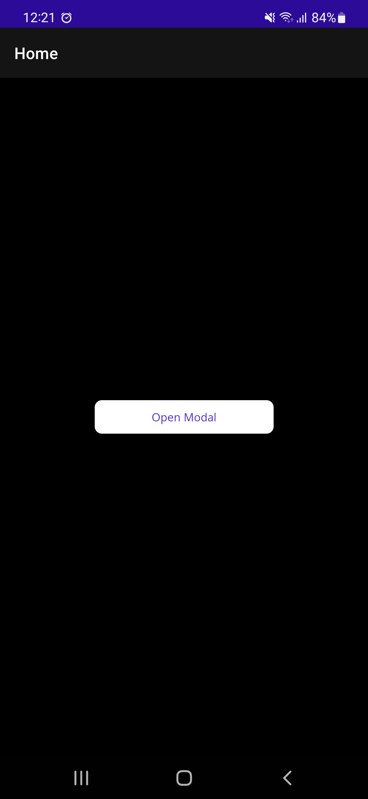
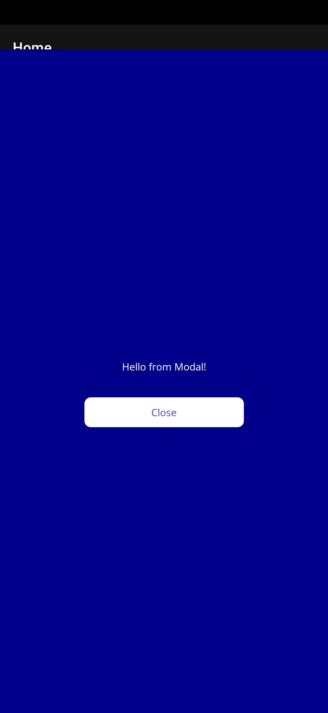

# dotnet-maui-bug-repro-modal-fullscreen

On Android, modal pages do not cover the entire screen when going into fullscreen and hiding system and navigation bars.
It appears that modal pages are not pushed up all the way, because the content is not centered correctly, either.

## Update with Visual Studio 17.7.0 Preview 1

The issue has indeed been improved with VS 17.7.0 Preview 1.0, but the status bar is still visible when using fullscreen and immersive mode on Android (Samsumg Galaxy S22):

<div>
  
</div>
</br>

## Screenshots

<div>
  
  
</div>
</br>

**Modal.xaml*

```xml
<?xml version="1.0" encoding="utf-8"?>
<ContentPage xmlns="http://schemas.microsoft.com/dotnet/2021/maui"
             xmlns:x="http://schemas.microsoft.com/winfx/2009/xaml"
             x:Class="bug_modal_fullscreen.ModalPage"
             Shell.NavBarIsVisible="False"
             Shell.PresentationMode="ModalAnimated"
             BackgroundColor="DarkBlue">

  <ContentPage.Content>

    <VerticalStackLayout
      VerticalOptions="Center"
      Spacing="30">

      <Label
        HorizontalOptions="Center"
        Text="Hello from Modal!" />

      <Button
        WidthRequest="200"
        Text="Close"
        Clicked="Button_OnClicked"/>

    </VerticalStackLayout>

  </ContentPage.Content>

</ContentPage>
```

**Modal.xaml.cs**

```c#
using bug_modal_fullscreen.Services;

namespace bug_modal_fullscreen;

public partial class ModalPage : ContentPage
{
    private readonly DeviceServices _deviceServices;

    public ModalPage()
    {
        InitializeComponent();

        _deviceServices = new DeviceServices();
    }

    private async void Button_OnClicked(object sender, EventArgs e)
    {
        await Shell.Current.GoToAsync("..");
    }

    protected override void OnAppearing()
    {
        base.OnAppearing();

        _deviceServices?.HideSystemControls();
    }

    protected override void OnDisappearing()
    {
        base.OnDisappearing();

        _deviceServices.ShowSystemControls();
    }
}
```

**Fullscreen code for Android**

```c#
using Android.App;
using Android.Views;

namespace bug_modal_fullscreen.Services;

public partial class DeviceServices
{
    protected static Activity Activity;

    public static void SetActivity(Activity activity)
    {
        Activity = activity;
    }

    public partial void HideSystemControls()
    {
        Activity?.Window?.AddFlags(WindowManagerFlags.Fullscreen | WindowManagerFlags.LayoutInScreen);
        Activity?.Window?.ClearFlags(WindowManagerFlags.ForceNotFullscreen);

        var controller = Activity?.Window?.InsetsController;
        controller?.Hide(WindowInsets.Type.SystemBars());
    }

    public partial void ShowSystemControls()
    {
        Activity?.Window?.AddFlags(WindowManagerFlags.ForceNotFullscreen);
        Activity?.Window?.ClearFlags(WindowManagerFlags.Fullscreen | WindowManagerFlags.LayoutInScreen);

        var controller = Activity?.Window?.InsetsController;
        controller?.Show(WindowInsets.Type.SystemBars());
    }
}
```
